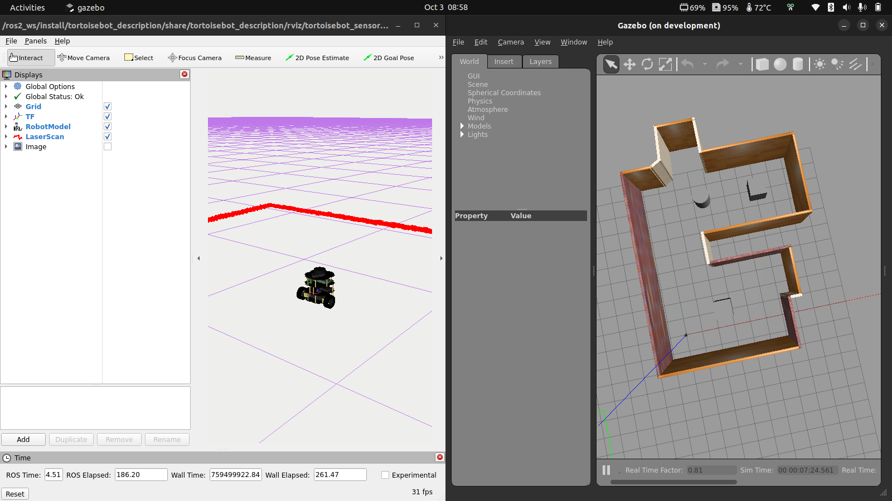

# Simulación TortoiseBot

Simulación del robot **TortoiseBot** (RigBetel Labs) para **ROS 2 Humble**, usada en los cursos de Kalman Robotics.



- [Simulación TortoiseBot](#simulación-tortoisebot)
  - [Requisitos](#requisitos)
  - [Instalación](#instalación)
  - [Uso](#uso)
  - [Versión con Docker](#versión-con-docker)
  - [Referencias](#referencias)

## Requisitos

- Ubuntu 22.04 con ROS 2 Humble instalado.

## Instalación

**1. Crea el workspace de simulación con su carpeta `src`:**

```bash
mkdir -p ~/sim_ws/src
cd ~/sim_ws/src
```

**2. Clona este repositorio:**

```bash
git clone https://github.com/Kalman-Robotics/sim_RigBetel-tortoisebot.git
```

**3. Descarga las dependencias con rosdep:**

Si es la primera vez que usas `rosdep` en tu máquina, inicialízalo:

```bash
sudo rosdep init
rosdep update
```

Luego, desde la raíz del workspace, instala todo lo que los paquetes necesitan (Gazebo incluido):

```bash
cd ~/sim_ws
rosdep install --from-paths src --ignore-src -r -y
```

**4. Compila el workspace y actívalo:**

```bash
colcon build
source install/setup.bash
```

## Uso

Verifica que los paquetes estén disponibles:

```bash
ros2 pkg list | grep tortoisebot
```

Lanza la simulación en el mundo que necesites:

```bash
ros2 launch tortoisebot_bringup bringup.launch.py use_sim_time:=True            # mundo estándar
ros2 launch tortoisebot_bringup bringup_vacio.launch.py use_sim_time:=True      # mundo vacío
ros2 launch tortoisebot_bringup bringup_laberinto.launch.py use_sim_time:=True  # laberinto
```

Para cerrar la simulación, presiona `Ctrl+C` en la terminal.

## Versión con Docker

Si prefieres un entorno dockerizado listo para usar, está disponible en la rama [`docker`](https://github.com/Kalman-Robotics/sim_RigBetel-tortoisebot/tree/docker).

## Referencias

- [Repositorio original de RigBetel Labs](https://github.com/rigbetellabs/tortoisebot)
- [YDLidar SDK — build e instalación](https://github.com/YDLIDAR/YDLidar-SDK/blob/master/doc/howto/how_to_build_and_install.md)
- [Wiki ROS 2 del TortoiseBot](https://github.com/rigbetellabs/tortoisebot/wiki/5.-ROS2)
